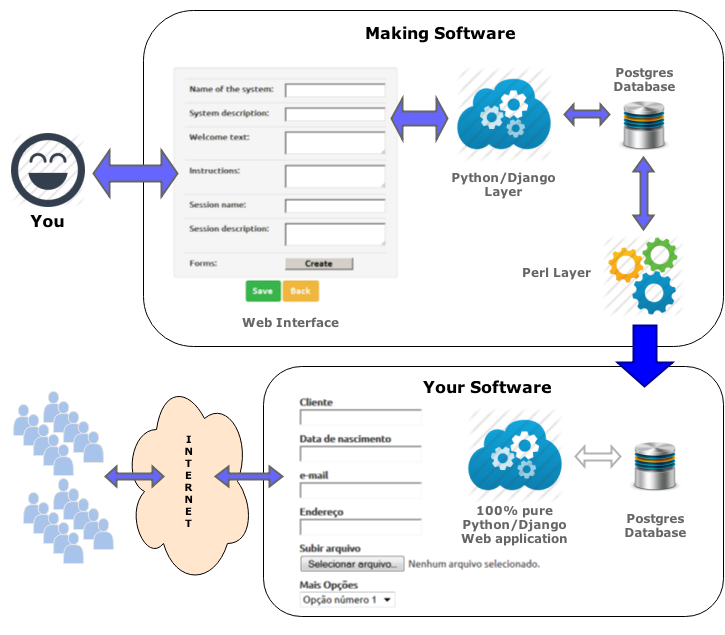

# Project Archived - Apr 29 2022

Install Guide
=============

Follow this document to install making_software.  
It will drive you to the default installation with sqlite database. 
This document has instructions to install both layers, Django and Perl. If you have doubts, send a message please.
https://github.com/fortinbras/making_software/blob/master/Install-Guide-EN.txt

Making Software
===============

This is a software to make software, where software means a web based system, in both ways. 
With this software the user can deploy his or her own web based system without write a single line of code.

It works only in Linux distributions; and for the moment it has been tested on Ubuntu and Slackware only.

This project has two systems, separated layers which work together tied by a database.

When you deploy your system, a completely independent system is created, without any external dependency. It is a 100% pure Python/Django system with it´s own database instance and a unique Apache virtual host appointment.

Macro happy path diagram
========================
This diagram shows the independency of each application, Making Software and created systems.  
Each has it´s on environment, database, webserver. No code is shared, nor extra libs are required.  
Created systems are 100% pure Django application. You can even move the system to another server with no impact.

1st layer - Loopware folder 
===========================
This is a Python/Django web application. 
Loopware is just a name, I will change in the future. 
This website provides a web interface of the making software, where the end user can create his/her own system, just by adding, arranging, removing and editing visual components on a web browser.

I have used some 3rd part packages that I am distributing with my main package. 
All of them have their own licenses included in the respective packages.
- allauth
- bsct
- django-fb-ifram-master
- wysiwyg_forms
- bootswatch
- django_admin_bootstrapped

Since it is a Django standard application, you can install as usual.

Database 
========
Database holds all data created on the 1st layer, and is readed by the 2nd layer.

2nd layer - making_software_perl folder
=======================================
This is a Perl standalone application. 
This application reads data stored in the database and generates systems (web based applications) created by end users.

In order to install this application, you need of course to have Perl installed in you distribution. 
You may need to install CPAN  modules required.

 

Behind the scenes
=================
If you want to read the concepts behind this project. Go to this paper:

http://robsonkoji.blogspot.com.br/2013/11/modeling-making-software.html

